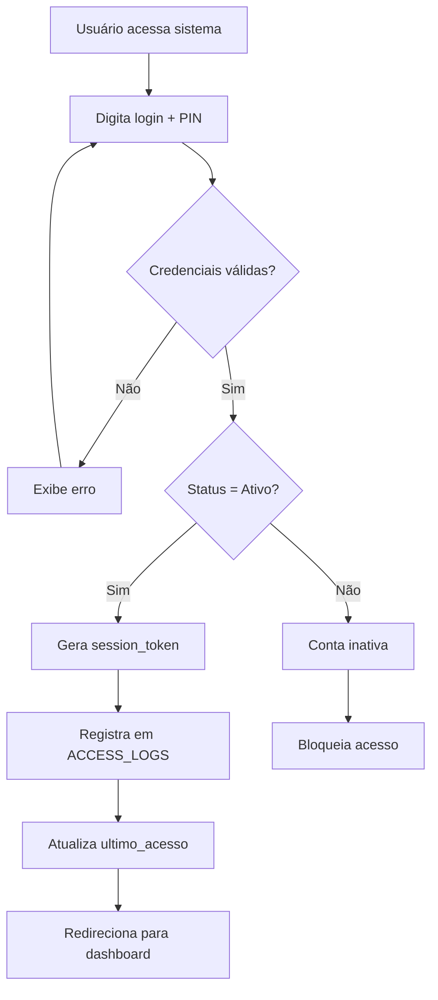
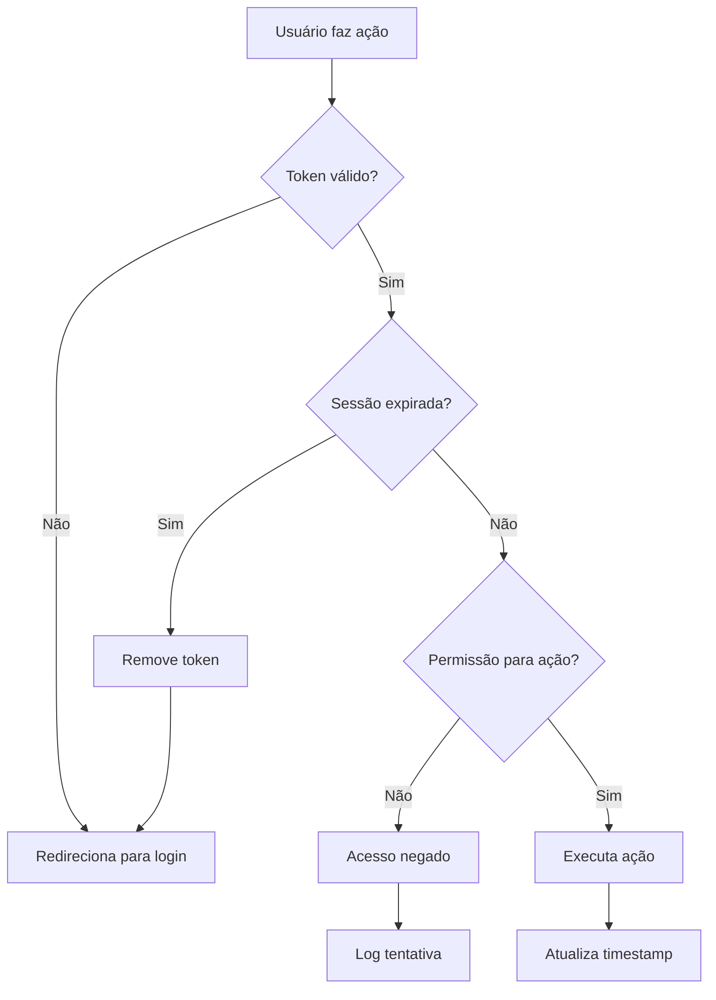
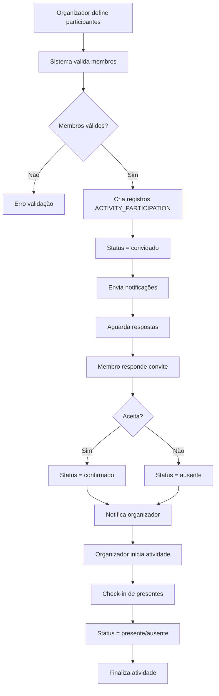
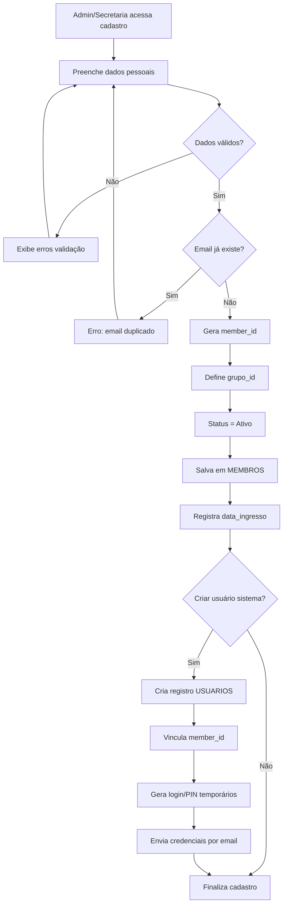
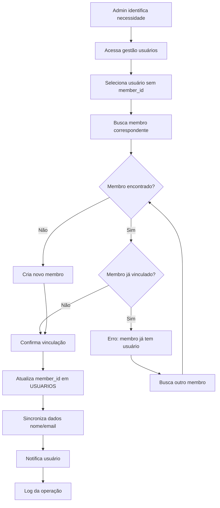
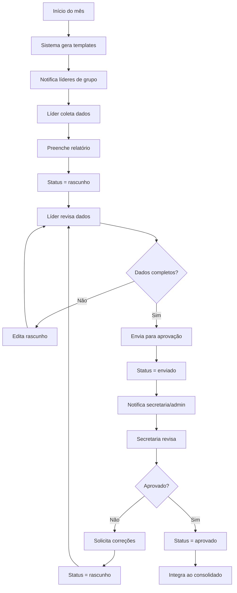
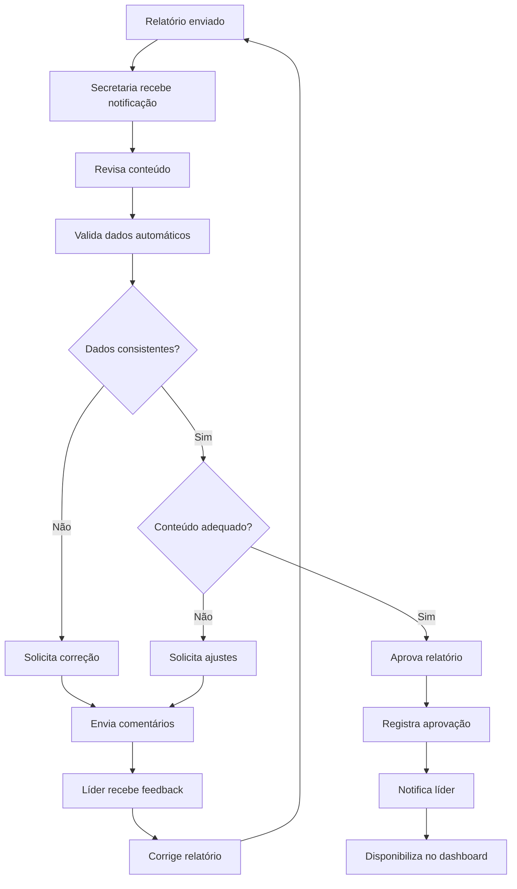
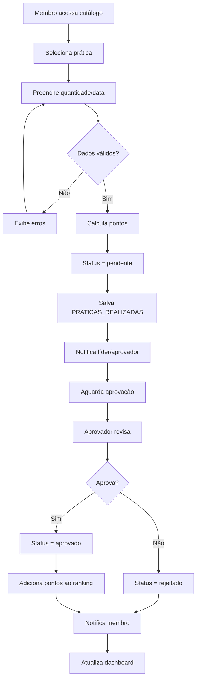

# 🔄 Fluxos de Negócio – Sistema Dojotai

<!-- TOC -->
- [Visão Geral dos Fluxos](#visão-geral-dos-fluxos)
- [Autenticação e Controle de Acesso](#autenticação-e-controle-de-acesso)
  - [Login do Usuário](#login-do-usuário)
  - [Controle de Sessão](#controle-de-sessão)
- [Gestão de Atividades](#gestão-de-atividades)
  - [Criação de Atividade](#criação-de-atividade)
  - [Participação em Atividades](#participação-em-atividades)
  - [Execução e Conclusão](#execução-e-conclusão)
- [Sistema de Membros](#sistema-de-membros)
  - [Cadastro de Membro](#cadastro-de-membro)
  - [Vinculação Usuário-Membro](#vinculação-usuário-membro)
- [Relatórios Mensais](#relatórios-mensais)
  - [Ciclo de Relatórios](#ciclo-de-relatórios)
  - [Aprovação Hierárquica](#aprovação-hierárquica)
- [Gamificação](#gamificação)
  - [Lançamento de Práticas](#lançamento-de-práticas)
  - [Sistema de Ranking](#sistema-de-ranking)
- [Controle de Materiais](#controle-de-materiais)
  - [Movimentação de Estoque](#movimentação-de-estoque)
  - [Alertas e Reposição](#alertas-e-reposição)
- [Organograma e Permissões](#organograma-e-permissões)
  - [Estrutura Hierárquica](#estrutura-hierárquica)
  - [Herança de Permissões](#herança-de-permissões)
- [Integração com Ondas](#integração-com-ondas)
  - [Importação de Dados](#importação-de-dados)
  - [Consolidação nos Relatórios](#consolidação-nos-relatórios)
<!-- /TOC -->

## Visão Geral dos Fluxos

O Sistema Dojotai opera através de **fluxos integrados** que conectam diferentes módulos para criar uma experiência unificada de gestão. Cada fluxo representa um processo de negócio específico com regras, validações e estados bem definidos.

### 🎯 **Princípios dos Fluxos**
- **Estado único**: Cada entidade tem um estado claro e rastreável
- **Auditoria completa**: Todas as ações críticas são logadas
- **Validações em cascata**: Mudanças em uma entidade validam entidades relacionadas
- **Permissões hierárquicas**: Acesso baseado na estrutura organizacional
- **Notificações automáticas**: Stakeholders são informados de mudanças relevantes

---

## Autenticação e Controle de Acesso

### Login do Usuário

#### **Fluxo Principal**


#### **Regras de Negócio**
1. **Validação de Credenciais**
   - Login deve existir na tabela `Usuarios`
   - PIN deve corresponder exatamente
   - Status deve ser "Ativo" (case-insensitive)

2. **Sessão e Segurança**
   - `session_token` gerado automaticamente
   - `ultimo_acesso` atualizado a cada login bem-sucedido
   - Log completo em `ACCESS_LOGS` (IP, user agent, timestamp)

3. **Tratamento de Erros**
   - Máximo 3 tentativas por IP em 5 minutos
   - Mensagens de erro genéricas (segurança)
   - Timeout automático de sessão (configurável)

#### **Estados da Sessão**
- **Ativa**: Usuário logado com token válido
- **Expirada**: Timeout automático ou inatividade
- **Revogada**: Logout manual ou administrativo

### Controle de Sessão

#### **Validação Contínua**


#### **Hierarquia de Permissões**
1. **Admin**: Acesso total ao sistema
2. **Secretaria**: Gestão operacional + aprovações
3. **Líder**: Gestão do seu grupo + relatórios
4. **Usuário**: Acesso às suas atividades + lançamentos

---

## Gestão de Atividades

### Criação de Atividade

#### **Fluxo de Criação**
```mermaid
graph TD
    A[Usuário clica "Nova Atividade"] --> B{Permissão para criar?}
    B -->|Não| C[Acesso negado]
    B -->|Sim| D[Exibe formulário]
    D --> E[Usuário preenche dados]
    E --> F{Dados válidos?}
    F -->|Não| G[Exibe erros]
    F -->|Sim| H{Categoria válida?}
    H -->|Não| I[Erro categoria]
    H -->|Sim| J{Responsável válido?}
    J -->|Não| K[Erro responsável]
    J -->|Sim| L[Gera ID sequencial]
    L --> M[Salva em ACTIVITIES]
    M --> N[Define status = Pendente]
    N --> O[Registra auditoria]
    O --> P[Notifica responsável]
    P --> Q[Redireciona para dashboard]
    G --> E
    I --> E
    K --> E
```

#### **Regras de Negócio**
1. **Validações Obrigatórias**
   - Título não pode estar vazio
   - Responsável deve ser usuário ativo
   - Categoria deve existir e estar ativa
   - Data não pode ser no passado (configurable)

2. **Geração de ID**
   - Formato: `ACT-NNNN` (ex: ACT-0001)
   - Sequencial baseado em IDs existentes
   - Único e imutável

3. **Auditoria Automática**
   - `criado_em` = timestamp atual
   - `atribuido_uid` = responsável selecionado
   - `atualizado_em` = vazio (só preenche em edições)

### Participação em Atividades

#### **Fluxo de Convites**


#### **Estados de Participação**
1. **convidado**: Convite enviado, aguardando resposta
2. **confirmado**: Membro confirmou presença
3. **ausente**: Membro recusou ou não respondeu
4. **presente**: Compareceu à atividade (confirmado via check-in)

### Execução e Conclusão

#### **Fluxo de Conclusão**
```mermaid
graph TD
    A[Usuário clica "Concluir"] --> B{Permissão para concluir?}
    B -->|Não| C[Acesso negado]
    B -->|Sim| D{Atividade ainda pendente?}
    D -->|Não| E[Já foi concluída]
    D -->|Sim| F[Confirma conclusão]
    F --> G[Status = Concluida]
    G --> H[concluido_por_uid = usuário atual]
    H --> I[concluido_em = timestamp]
    I --> J[atualizado_em = timestamp]
    J --> K[atualizado_uid = usuário atual]
    K --> L[Notifica participantes]
    L --> M[Solicita relato/fotos]
    M --> N[Atualiza dashboard]
```

#### **Permissões para Conclusão**
- **Responsável** da atividade: Sempre pode concluir
- **Admin/Secretaria**: Pode concluir qualquer atividade
- **Líder**: Pode concluir atividades do seu grupo
- **Outros usuários**: Não podem concluir

---

## Sistema de Membros

### Cadastro de Membro

#### **Fluxo de Cadastro**


#### **Regras de Negócio**
1. **Dados Obrigatórios**
   - Nome completo
   - Data de nascimento
   - Email (único no sistema)
   - Telefone principal

2. **Validações Automáticas**
   - Email formato válido e único
   - Data nascimento não futura
   - Telefone formato brasileiro
   - CPF válido (se informado)

3. **Integração com Usuários**
   - Criação de usuário é opcional
   - Se criado, `member_id` vincula automaticamente
   - Login inicial = email, PIN = últimos 4 dígitos telefone

### Vinculação Usuário-Membro

#### **Fluxo de Vinculação**


#### **Sincronização de Dados**
- Nome do usuário atualizado com nome do membro
- Email sincronizado automaticamente
- Papel definido baseado no cargo do membro
- Permissões herdadas do grupo

---

## Relatórios Mensais

### Ciclo de Relatórios

#### **Fluxo Mensal**


#### **Prazos e Regras**
1. **Cronograma Padrão**
   - Dia 1: Templates disponíveis
   - Dia 10: Prazo para envio pelos líderes
   - Dia 15: Prazo para aprovação
   - Dia 20: Consolidação final

2. **Conteúdo Automático**
   - Estatísticas de atividades do grupo
   - Lista de participações por membro
   - Dados de gamificação (se ativo)
   - Observações pendentes

### Aprovação Hierárquica

#### **Fluxo de Aprovação**


---

## Gamificação

### Lançamento de Práticas

#### **Fluxo de Lançamento**


#### **Regras de Pontuação**
1. **Cálculo de Pontos**
   - Pontos base da prática × quantidade
   - Multiplicadores por categoria/dificuldade
   - Bônus por consistência (práticas diárias)

2. **Validações**
   - Data não pode ser futura
   - Quantidade deve ser positiva
   - Máximo 3 lançamentos da mesma prática por dia

### Sistema de Ranking

#### **Atualização de Rankings**
```mermaid
graph TD
    A[Prática aprovada] --> B[Adiciona pontos ao membro]
    B --> C[Recalcula ranking mensal]
    C --> D[Recalcula ranking geral]
    D --> E[Atualiza posições]
    E --> F{Mudança significativa?}
    F -->|Sim| G[Notifica sobre nova posição]
    F -->|Não| H[Atualização silenciosa]
    G --> I[Verifica conquistas]
    H --> I
    I --> J{Nova conquista?}
    J -->|Sim| K[Registra badge]
    J -->|Não| L[Finaliza atualização]
    K --> M[Notifica conquista]